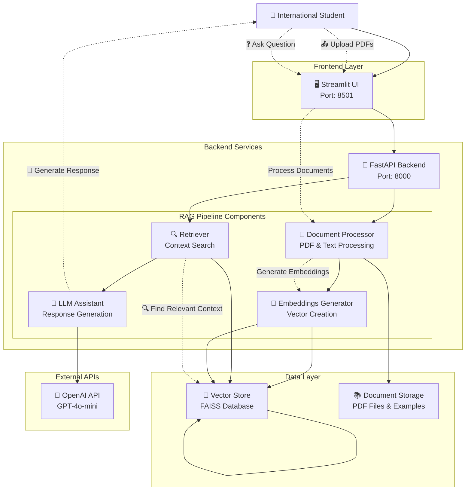

# OPT-RAG: International Student Visa Assistant

OPT-RAG is a Retrieval-Augmented Generation (RAG) application designed to help international students navigate visa-related issues, OPT applications, and other immigration concerns.

## Project Overview

The OPT-RAG application uses retrieval-augmented generation to provide accurate information by retrieving relevant content from official documentation and policies. The application consists of:

- **Backend (FastAPI)**: Processes documents, maintains vector store, and handles queries
- **Frontend (Streamlit)**: Provides user interface for interacting with the assistant

## System Architecture


```mermaid
graph TB
    %% User Layer
    User[👤 International Student]
    
    %% Frontend Layer
    subgraph "Frontend Layer"
        UI[🖥️ Streamlit UI<br/>Port: 8501]
    end
    
    %% Backend Services Layer
    subgraph "Backend Services"
        API[🚀 FastAPI Backend<br/>Port: 8000]
        
        subgraph "RAG Pipeline Components"
            DOC[📄 Document Processor<br/>PDF & Text Processing]
            EMB[🧠 Embeddings Generator<br/>Vector Creation]
            RET[🔍 Retriever<br/>Context Search]
            LLM[🤖 LLM Assistant<br/>Response Generation]
        end
    end
    
    %% Data Storage Layer
    subgraph "Data Layer"
        VS[💾 Vector Store<br/>FAISS Database]
        DOCS[📚 Document Storage<br/>PDF Files & Examples]
    end
    
    %% External Services
    subgraph "External APIs"
        OPENAI[🌟 OpenAI API<br/>GPT-4o-mini]
    end
    
    %% User Flow
    User --> UI
    UI --> API
    
    %% RAG Pipeline Flow
    API --> DOC
    DOC --> EMB
    EMB --> VS
    API --> RET
    RET --> VS
    RET --> LLM
    LLM --> OPENAI
    
    %% Data Persistence
    DOC --> DOCS
    EMB --> VS
    VS --> VS
    
    %% Document Upload Flow
    User -.->|"📤 Upload PDFs"| UI
    UI -.->|"Process Documents"| DOC
    DOC -.->|"Generate Embeddings"| EMB
    
    %% Query Flow
    User -.->|"❓ Ask Question"| UI
    RET -.->|"🔍 Find Relevant Context"| VS
    LLM -.->|"📝 Generate Response"| User
```

## Getting Started

### Prerequisites

- [Docker](https://docs.docker.com/get-docker/)
- [Docker Compose](https://docs.docker.com/compose/install/)
- OpenAI API key (get one from [OpenAI Platform](https://platform.openai.com/api-keys))

### Quick Start (API Mode)

1. **Clone the Repository**
```bash
git clone <repository-url>
cd OPT-RAG
```

2. **Set Up Environment Variables**
```bash
# Create .env file with your OpenAI API key
echo "OPENAI_API_KEY=your_openai_api_key_here" > .env
```

3. **Start the Application**
```bash
# Start all services
docker-compose up -d

# Check if services are running
docker-compose ps
```

4. **Access the Application**
- Frontend UI: http://localhost:8501
- Backend API: http://localhost:8000/docs

### Alternative: Local Model Setup

If you prefer to run without the OpenAI API, you can use a local model:

1. **Download the Model**
```bash
# Create models directory
mkdir -p rag-pipeline/models

# Download using Python
pip install huggingface-hub
python -c "from huggingface_hub import snapshot_download; snapshot_download(repo_id='Qwen/Qwen2.5-1.5B', local_dir='./rag-pipeline/models/qwen2.5-1.5b')"
```

2. **Configure for Local Model**
```bash
# Set environment variable
echo "OPT_RAG_USE_API_LLM=false" >> .env

# Start the services
docker-compose up -d
```

## Features

- Upload and process official immigration documents
- Ask questions in natural language about visa and immigration topics
- Get context-aware responses based on official documentation
- Reference sources used to generate answers
- Maintain conversation context

## Usage

### Document Upload
1. Go to http://localhost:8501
2. Use the sidebar to upload PDF documents
3. Documents will be processed and added to the vector store
4. You can then ask questions about the uploaded content

### Asking Questions
Simply type your question in the chat interface and wait for the response. The system will:
1. Search through the uploaded documents
2. Find relevant information
3. Generate a comprehensive answer
4. Provide references to source documents

## Project Structure

```
OPT-RAG/
├── rag-pipeline/           # Backend service
│   ├── src/               # Core RAG implementation
│   │   ├── document_processor/  # Document handling
│   │   ├── llm/          # LLM integration
│   │   ├── retriever/    # Vector store
│   │   └── utils/        # Utilities
│   ├── examples/         # Sample documents
│   └── tests/            # Test suite
└── streamlit/            # Frontend UI
    └── app.py           # Streamlit application
```

## License

[MIT License](LICENSE)

## Disclaimer

This assistant provides information based on available documents. It is not a substitute for legal advice. 