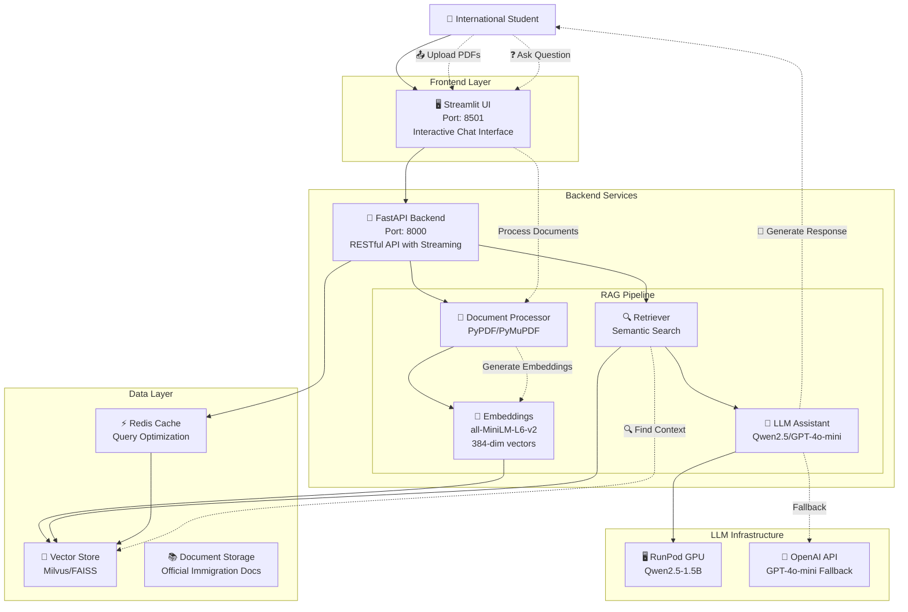

# OPT-RAG: International Student Visa Assistant

OPT-RAG is a Retrieval-Augmented Generation (RAG) system designed to help international students navigate visa-related issues, OPT applications, study/work authorization questions, and other immigration concerns. The system provides accurate, context-aware responses from official documentation.

## 🎯 Target Users

- International students in the United States
- University international student advisors
- Immigration support staff
- Prospective international students

## 🚀 Core Features

### Document Processing & RAG Pipeline
- **Automated PDF Processing**: Intelligent document ingestion with chunking (1000 tokens, 200 overlap)
- **Semantic Search**: Vector similarity search for finding relevant information
- **Context-Aware Generation**: RAG pipeline that provides responses with source attribution
- **Streaming Responses**: Real-time response generation with Server-Sent Events (SSE)
- **Session Management**: Maintains conversation context throughout the session

### Multi-Modal Capabilities
- **PDF Text Extraction**: Preserves document layout while extracting content
- **Intelligent Chunking**: Content-aware segmentation for better context retention
- **Source Citation**: Automatic linking to source documents for verification
- **Query Control**: User-controllable request termination
- **Content Caching**: Hash-based vector store caching for improved efficiency

## 🏗️ System Architecture


```mermaid
graph TB
    %% User Layer
    User[👤 International Student]
    
    %% Frontend Layer
    subgraph "Frontend Layer"
        UI[🖥️ Streamlit UI<br/>Port: 8501<br/>Interactive Chat Interface]
    end
    
    %% Backend Services Layer
    subgraph "Backend Services"
        API[🚀 FastAPI Backend<br/>Port: 8000<br/>RESTful API with Streaming]
        
        subgraph "RAG Pipeline"
            DOC[📄 Document Processor<br/>PyPDF/PyMuPDF]
            EMB[🧠 Embeddings<br/>all-MiniLM-L6-v2<br/>384-dim vectors]
            RET[🔍 Retriever<br/>Semantic Search]
            LLM[🤖 LLM Assistant<br/>Qwen2.5/GPT-4o-mini]
        end
    end
    
    %% Data Storage Layer
    subgraph "Data Layer"
        VS[💾 Vector Store<br/>Milvus/FAISS]
        DOCS[📚 Document Storage<br/>Official Immigration Docs]
        CACHE[⚡ Redis Cache<br/>Query Optimization]
    end
    
    %% External Services
    subgraph "LLM Infrastructure"
        RUNPOD[🖥️ RunPod GPU<br/>Qwen2.5-1.5B]
        OPENAI[🌟 OpenAI API<br/>GPT-4o-mini Fallback]
    end
    
    %% User Flow
    User --> UI
    UI --> API
    
    %% RAG Pipeline Flow
    API --> DOC
    DOC --> EMB
    EMB --> VS
    API --> RET
    RET --> VS
    RET --> LLM
    LLM --> RUNPOD
    LLM -.->|Fallback| OPENAI
    
    %% Cache Integration
    API --> CACHE
    CACHE --> VS
    
    %% Document Flow
    User -.->|"📤 Upload PDFs"| UI
    UI -.->|"Process Documents"| DOC
    DOC -.->|"Generate Embeddings"| EMB
    
    %% Query Flow
    User -.->|"❓ Ask Question"| UI
    RET -.->|"🔍 Find Context"| VS
    LLM -.->|"📝 Generate Response"| User
```

## 📚 Data Sources

- **Official Documentation**: USCIS, Department of State, SEVP resources
- **University Policies**: Institution-specific international student guidelines
- **Legal Documents**: I-20, DS-2019, visa application examples
- **Regulatory Updates**: Current OPT/CPT guidelines and policy changes

## 🚀 Getting Started

### Prerequisites

- [Docker](https://docs.docker.com/get-docker/) and [Docker Compose](https://docs.docker.com/compose/install/)
- Python 3.10+
- 8GB RAM minimum
- API Key (OpenAI or RunPod) for LLM inference

### Quick Start

1. **Clone the Repository**
```bash
git clone https://github.com/kitan23/LLM-Agent-for-Visa.git
cd OPT-RAG
```

2. **Set Up Environment Variables**
```bash
# Create .env file with your configuration
cat > .env << EOF
# LLM Configuration (choose one)
OPENAI_API_KEY=your_openai_api_key_here  # For OpenAI
# OR
RUNPOD_API_KEY=your_runpod_api_key_here  # For RunPod

# Optional: Use local model instead
OPT_RAG_USE_API_LLM=false  # Set to false for local model
EOF
```

3. **Start the Application**
```bash
# Start all services with Docker Compose
docker-compose up -d

# Check service status
docker-compose ps

# View logs
docker-compose logs -f
```

4. **Access the Application**
- **Chat Interface**: http://localhost:8501
- **API Documentation**: http://localhost:8000/docs
- **Health Check**: http://localhost:8000/health

### Local Development Setup

For development without Docker:

```bash
# Install dependencies
pip install -r requirements.txt

# Start backend
cd rag-pipeline
uvicorn src.main:app --reload --port 8000

# In another terminal, start frontend
cd streamlit
streamlit run app.py --server.port 8501
```

## 💡 Usage Guide

### Uploading Documents

1. Navigate to http://localhost:8501
2. Use the sidebar to upload PDF documents
3. Wait for processing confirmation
4. Documents are automatically chunked and indexed

### Asking Questions

Simply type your visa-related questions in the chat interface:

**Example Questions:**
- "What are the requirements for OPT application?"
- "How long can I stay in the US after my F-1 visa expires?"
- "Can I work on CPT while maintaining full-time student status?"
- "What documents do I need for visa renewal?"

The system will:
1. Search through uploaded documents for relevant context
2. Retrieve the most pertinent information
3. Generate a comprehensive, accurate response
4. Provide citations to source documents

### Response Features

- **Source Attribution**: Each response includes references to source documents
- **Context Preservation**: Maintains conversation history for follow-up questions
- **Real-time Streaming**: See responses as they're generated
- **Query Cancellation**: Stop long-running queries if needed

## 📁 Project Structure

```
OPT-RAG/
├── rag-pipeline/              # Backend RAG service
│   ├── src/
│   │   ├── document_processor/  # PDF processing & chunking
│   │   ├── llm/                # LLM integration & assistants
│   │   ├── retriever/          # Vector store & search
│   │   ├── embeddings/         # Embedding generation
│   │   └── main.py            # FastAPI application
│   ├── data/
│   │   ├── raw/               # Original PDF documents
│   │   └── processed/         # Processed chunks & embeddings
│   └── Dockerfile
├── streamlit/                 # Frontend UI
│   ├── app.py                # Streamlit chat interface
│   └── Dockerfile
├── docker-compose.yml        # Service orchestration
├── .env.example             # Environment variables template
└── README.md               # This file
```

## 📊 Performance Metrics

### Target Performance
- **Query Response Time**: < 3 seconds (95th percentile)
- **Vector Retrieval Latency**: < 500ms
- **LLM Inference Time**: < 2 seconds
- **Document Processing**: > 100 pages/hour
- **System Uptime**: > 99.5%

### Current Status
- ✅ Core RAG pipeline implemented
- ✅ Document processing and chunking operational
- ✅ Vector store with semantic search working
- ✅ Streaming responses enabled
- ✅ Session-based conversation context

## 🛠️ Configuration

### Vector Store Settings
```python
# Milvus configuration
VECTOR_DIMENSION = 384
INDEX_TYPE = "IVF_FLAT"
METRIC_TYPE = "L2"
CHUNK_SIZE = 1000
CHUNK_OVERLAP = 200
```

### LLM Options
- **Primary**: Qwen2.5-1.5B (via RunPod)
- **Fallback**: OpenAI GPT-4o-mini
- **Local**: Qwen2.5-0.5B or Qwen2.5-1.5B

## 🔧 Troubleshooting

### Common Issues

1. **Services not starting**
   - Check Docker/Docker Compose installation
   - Verify port availability (8000, 8501)
   - Review logs: `docker-compose logs`

2. **LLM not responding**
   - Verify API key in `.env` file
   - Check network connectivity
   - Confirm RunPod/OpenAI service status

3. **Document processing fails**
   - Ensure PDF is not corrupted
   - Check file size (< 10MB recommended)
   - Verify sufficient memory available

### Getting Help

- Check logs: `docker-compose logs [service-name]`
- API health: http://localhost:8000/health
- Submit issues: [GitHub Issues](https://github.com/kitan23/LLM-Agent-for-Visa/issues)

## 📝 License

[MIT License](LICENSE)

## ⚠️ Disclaimer

This assistant provides information based on available documentation and is designed to help navigate visa-related questions. However, it is **not a substitute for legal advice**. Always consult with qualified immigration attorneys or official government sources for critical decisions.

## 🤝 Contributing

Contributions are welcome! Please read our contributing guidelines and submit pull requests to our repository.

## 📧 Contact

For questions or support, please open an issue on GitHub or contact the maintainers.

---

Built with ❤️ for the international student community