# OPT-RAG: International Student Visa Assistant

OPT-RAG is a Retrieval-Augmented Generation (RAG) application designed to help international students navigate visa-related issues, OPT applications, and other immigration concerns.

## Project Overview

The OPT-RAG application uses retrieval-augmented generation to provide accurate information by retrieving relevant content from official documentation and policies. The application consists of:

- **Backend (FastAPI)**: Processes documents, maintains vector store, and handles queries
- **Frontend (Streamlit)**: Provides user interface for interacting with the assistant
- **API Gateway (NGINX)**: Routes requests between services
- **Monitoring Stack**: Prometheus, Grafana, and Jaeger for observability

## System Architecture

```mermaid
graph TB
    %% User Layer
    User[👤 International Student]
    
    %% Frontend Layer
    subgraph "Frontend Layer"
        UI[🖥️ Streamlit UI<br/>Port: 8501]
    end
    
    %% API Gateway Layer
    subgraph "API Gateway"
        NGINX[🌐 NGINX Gateway<br/>Load Balancer & Routing]
    end
    
    %% Backend Services Layer
    subgraph "Backend Services"
        API[🚀 FastAPI Backend<br/>Port: 8000]
        
        subgraph "RAG Pipeline Components"
            DOC[📄 Document Processor<br/>PDF & Text Processing]
            EMB[🧠 Embeddings Generator<br/>Vector Creation]
            RET[🔍 Retriever<br/>Context Search]
            LLM[🤖 LLM Assistant<br/>Response Generation]
        end
    end
    
    %% Data Storage Layer
    subgraph "Data Layer"
        VS[💾 Vector Store<br/>FAISS Database]
        DOCS[📚 Document Storage<br/>PDF Files & Examples]
    end
    
    %% External Services
    subgraph "External APIs"
        OPENAI[🌟 OpenAI API<br/>GPT-4o-mini]
    end
    
    %% Monitoring Stack
    subgraph "Observability Stack"
        PROM[📊 Prometheus<br/>Metrics Collection]
        GRAF[📈 Grafana<br/>Dashboards & Alerts]
        JAEG[🔍 Jaeger<br/>Distributed Tracing]
    end
    
    %% Kubernetes Infrastructure
    subgraph "Kubernetes Infrastructure"
        subgraph "Persistent Storage"
            PVC[💿 Persistent Volume<br/>Vector Store Data]
        end
        
        subgraph "Secrets Management"
            SEC[🔐 Kubernetes Secrets<br/>API Keys & Config]
        end
    end
    
    %% User Flow
    User --> UI
    UI --> NGINX
    NGINX --> API
    
    %% RAG Pipeline Flow
    API --> DOC
    DOC --> EMB
    EMB --> VS
    API --> RET
    RET --> VS
    RET --> LLM
    LLM --> OPENAI
    
    %% Data Persistence
    DOC --> DOCS
    EMB --> PVC
    VS --> PVC
    
    %% Configuration
    API --> SEC
    LLM --> SEC
    
    %% Monitoring Flow
    API --> PROM
    UI --> PROM
    NGINX --> PROM
    PROM --> GRAF
    API --> JAEG
    LLM --> JAEG
    
    %% Document Upload Flow
    User -.->|"📤 Upload PDFs"| UI
    UI -.->|"Process Documents"| DOC
    DOC -.->|"Generate Embeddings"| EMB
    
    %% Query Flow
    User -.->|"❓ Ask Question"| UI
    RET -.->|"🔍 Find Relevant Context"| VS
    LLM -.->|"📝 Generate Response"| User
    
         %% Styling for bright background and high contrast
     classDef userClass fill:#e3f2fd,stroke:#1976d2,stroke-width:2px,color:#000000
     classDef frontendClass fill:#f3e5f5,stroke:#7b1fa2,stroke-width:2px,color:#000000
     classDef gatewayClass fill:#e8f5e8,stroke:#388e3c,stroke-width:2px,color:#000000
     classDef backendClass fill:#fff3e0,stroke:#f57c00,stroke-width:2px,color:#000000
     classDef dataClass fill:#fce4ec,stroke:#c2185b,stroke-width:2px,color:#000000
     classDef externalClass fill:#e0f7fa,stroke:#00796b,stroke-width:2px,color:#000000
     classDef monitoringClass fill:#f1f8e9,stroke:#558b2f,stroke-width:2px,color:#000000
     classDef infraClass fill:#f5f5f5,stroke:#616161,stroke-width:2px,color:#000000
     
     class User userClass
     class UI frontendClass
     class NGINX gatewayClass
     class API,DOC,EMB,RET,LLM backendClass
     class VS,DOCS,PVC dataClass
     class OPENAI externalClass
     class PROM,GRAF,JAEG monitoringClass
     class SEC infraClass
```



The diagram above illustrates the complete system architecture showing:
- **User Flow**: Solid lines representing the main request flow
- **Data Flow**: Dotted lines showing document processing and query handling
- **Components**: All major services including RAG pipeline, monitoring, and infrastructure
- **Infrastructure**: Kubernetes-based deployment with persistent storage and secrets management

## Getting Started

### Prerequisites

- [Docker](https://docs.docker.com/get-docker/)
- [Docker Compose](https://docs.docker.com/compose/install/)
- For cloud deployment: [Google Cloud SDK](https://cloud.google.com/sdk/docs/install)

## 🚀 Local Setup & Development

This section provides comprehensive instructions for running OPT-RAG locally on your development machine. You can choose between two modes:

### **Option 1: API Mode (Recommended - Faster Setup)**
Uses OpenAI's GPT-4o-mini model via API calls.

### **Option 2: Local Model Mode**
Downloads and runs a local language model (Qwen2.5-1.5B).

---

## 🏃‍♂️ Quick Start (API Mode)

### Prerequisites
- [Docker](https://docs.docker.com/get-docker/) and [Docker Compose](https://docs.docker.com/compose/install/)
- OpenAI API key (get one from [OpenAI Platform](https://platform.openai.com/api-keys))

### Step 1: Clone the Repository
```bash
git clone <repository-url>
cd OPT-RAG
```

### Step 2: Set Up Environment Variables
Create a `.env` file in the root directory:
```bash
# Create .env file with your OpenAI API key
echo "OPENAI_API_KEY=your_openai_api_key_here" > .env

# Or alternatively, set the environment variable
export OPENAI_API_KEY="your_openai_api_key_here"
```

### Step 3: Enable Backend Service
Uncomment the backend service in `docker-compose.yml`:
```bash
# Edit docker-compose.yml to uncomment the 'api' service section
# Lines 18-36 should be uncommented
```

### Step 4: Start the Application
```bash
# Start all services
docker-compose up -d

# Check if services are running
docker-compose ps
```

### Step 5: Access the Application
- **Frontend UI**: http://localhost:8501
- **Backend API**: http://localhost:8000/docs
- **Monitoring**:
  - Prometheus: http://localhost:9090
  - Grafana: http://localhost:3000 (admin/admin)
  - Jaeger: http://localhost:16686

---

## 📚 Local Model Setup (Alternative Option)

### Prerequisites
- [Docker](https://docs.docker.com/get-docker/) and [Docker Compose](https://docs.docker.com/compose/install/)
- At least 8GB RAM and 10GB free disk space
- Python 3.10+ (for model downloading)

### Step 1: Clone the Repository
```bash
git clone <repository-url>
cd OPT-RAG
```

### Step 2: Download Local Model
```bash
# Create models directory
mkdir -p rag-pipeline/models

# Option A: Download using Python
pip install huggingface-hub
python -c "from huggingface_hub import snapshot_download; snapshot_download(repo_id='Qwen/Qwen2.5-1.5B', local_dir='./rag-pipeline/models/qwen2.5-1.5b')"

# Option B: Download using Git LFS (alternative)
cd rag-pipeline/models
git lfs install
git clone https://huggingface.co/Qwen/Qwen2.5-1.5B qwen2.5-1.5b
cd ../..
```

### Step 3: Configure for Local Model
Edit `docker-compose.yml` to uncomment the backend service and set local model configuration:
```yaml
# Uncomment the 'api' service section (lines 18-36)
# Ensure environment variables are set for local model:
environment:
  - MODEL_PATH=/app/models/qwen2.5-1.5b
  - VECTOR_STORE_PATH=/app/vector_store
  - DEVICE=cpu
  - OTLP_ENDPOINT=http://jaeger:4317
  - OPT_RAG_USE_API_LLM=false  # This enables local model mode
```

### Step 4: Start the Application
```bash
# Start all services
docker-compose up -d

# Monitor logs to see model loading progress
docker-compose logs -f api
```

### Step 5: Access the Application
Same as API mode - check the Quick Start section above.

---

## 🔧 Configuration Options

### Environment Variables
You can configure the application using environment variables:

```bash
# API Mode Configuration
OPENAI_API_KEY=your_openai_api_key_here
OPT_RAG_USE_API_LLM=true
OPT_RAG_LLM_API_MODEL=gpt-4o-mini
OPT_RAG_LLM_API_PROVIDER=openai

# Local Model Configuration
OPT_RAG_USE_API_LLM=false
OPT_RAG_MODEL_PATH=./models/qwen2.5-1.5b
OPT_RAG_DEVICE=cpu

# Server Configuration
OPT_RAG_HOST=0.0.0.0
OPT_RAG_PORT=8000
OPT_RAG_LOG_LEVEL=INFO

# Vector Store Configuration
OPT_RAG_VECTOR_STORE_PATH=./vector_store
```

### Docker Compose Service Configuration
The application consists of several services:

- **api**: FastAPI backend with RAG pipeline
- **streamlit-ui**: Streamlit frontend interface
- **nginx**: API Gateway and load balancer
- **prometheus**: Metrics collection
- **grafana**: Dashboard and visualization
- **jaeger**: Distributed tracing

---

## 📤 Document Upload & Processing

### Upload Documents via UI
1. Go to http://localhost:8501
2. Use the sidebar to upload PDF documents
3. Documents will be processed and added to the vector store
4. You can then ask questions about the uploaded content

### Upload Documents via API
```bash
# Upload a document via API
curl -X POST "http://localhost:8000/upload" \
  -H "Content-Type: multipart/form-data" \
  -F "file=@/path/to/your/document.pdf"
```

### Pre-populate with Sample Documents
```bash
# Copy sample documents to the upload directory
cp path/to/your/visa-documents/* rag-pipeline/uploaded_pdfs/

# Restart the backend to process new documents
docker-compose restart api
```

---

## 🔍 Testing & Validation

### Health Checks
```bash
# Check backend health
curl http://localhost:8000/health

# Check frontend
curl http://localhost:8501

# Check all services
docker-compose ps
```

### Test API Endpoints
```bash
# Get available endpoints
curl http://localhost:8000/docs

# Test query endpoint
curl -X POST "http://localhost:8000/query" \
  -H "Content-Type: application/json" \
  -d '{"query": "What is OPT?", "conversation_id": "test"}'
```

### Monitor Logs
```bash
# View all logs
docker-compose logs

# View specific service logs
docker-compose logs -f api
docker-compose logs -f streamlit-ui
docker-compose logs -f nginx
```

---

## 🛠️ Troubleshooting

### Common Issues

#### 1. Backend Not Starting
```bash
# Check logs
docker-compose logs api

# Common fixes:
# - Ensure OpenAI API key is set (API mode)
# - Ensure model files exist (Local model mode)
# - Check port 8000 is not in use
```

#### 2. Frontend Can't Connect to Backend
```bash
# Check if backend is running
curl http://localhost:8000/health

# Check docker network
docker network ls
docker network inspect opt-rag_opt-rag-network
```

#### 3. Model Loading Issues (Local Mode)
```bash
# Check if model files exist
ls -la rag-pipeline/models/qwen2.5-1.5b/

# Check available disk space
df -h

# Monitor model loading
docker-compose logs -f api | grep -i model
```

#### 4. Port Conflicts
```bash
# Check if ports are in use
lsof -i :8000  # Backend
lsof -i :8501  # Frontend
lsof -i :80    # NGINX

# Use different ports in docker-compose.yml if needed
```

### Performance Optimization

#### For API Mode:
- Use faster OpenAI models (gpt-3.5-turbo) for development
- Implement response caching
- Optimize vector store size

#### For Local Model Mode:
- Increase Docker memory limit
- Use GPU if available (modify Dockerfile)
- Use quantized models for better performance

---

## 🧹 Cleanup

### Stop Services
```bash
# Stop all services
docker-compose down

# Stop and remove volumes
docker-compose down -v

# Remove built images
docker-compose down --rmi all
```

### Clean Up Resources
```bash
# Remove downloaded models (if using local mode)
rm -rf rag-pipeline/models/

# Remove vector store
rm -rf rag-pipeline/vector_store/

# Remove uploaded documents
rm -rf rag-pipeline/uploaded_pdfs/
```

### Cloud Deployment (GKE)

#### Step 1: Install Google Cloud SDK

See [kubernetes/gcloud-install-guide.md](kubernetes/gcloud-install-guide.md) for detailed instructions on installing and setting up the Google Cloud SDK.

#### Step 2: Deploy to Google Kubernetes Engine

The simplest way to deploy the application to GKE is to use the provided script:

```bash
chmod +x kubernetes/deploy-to-gke.sh
./kubernetes/deploy-to-gke.sh -p YOUR_GCP_PROJECT_ID
```

For more detailed instructions, refer to [kubernetes/README.md](kubernetes/README.md).

## Project Structure

The project follows a modular structure:

- `rag-pipeline/`: Backend service with document processing and vector store
- `streamlit/`: Frontend UI for user interaction
- `nginx/`: API Gateway configuration
- `kubernetes/`: Kubernetes deployment manifests
- `prometheus/`, `grafana/`, `jaeger/`: Monitoring components

## Features

- Upload and process official immigration documents
- Ask questions in natural language about visa and immigration topics
- Get context-aware responses based on official documentation
- Reference sources used to generate answers
- Maintain conversation context

## Monitoring

The application includes a comprehensive monitoring stack:

- **Prometheus**: Collects metrics from all services
- **Grafana**: Visualizes metrics with customizable dashboards
- **Jaeger**: Distributed tracing for request flows

## Documentation

- [Project Structure](project-structure.md)
- [PRD (Product Requirements Document)](prd.md)
- [Kubernetes Deployment Guide](kubernetes/README.md)
- [NGINX Gateway](NGINX-GATEWAY.md)
- [Monitoring Setup](MONITORING.md)
- [GKE Deployment Guide](opt-rag-gke-deployment-guide.md)

## License

[MIT License](LICENSE)

## Disclaimer

This assistant provides information based on available documents. It is not a substitute for legal advice. 