# OPT-RAG: International Student Visa Assistant

OPT-RAG is a Retrieval-Augmented Generation (RAG) application designed to help international students navigate visa-related issues, OPT applications, and other immigration concerns.

## Project Overview

The OPT-RAG application uses retrieval-augmented generation to provide accurate information by retrieving relevant content from official documentation and policies. The application consists of:

- **Backend (FastAPI)**: Processes documents, maintains vector store, and handles queries
- **Frontend (Streamlit)**: Provides user interface for interacting with the assistant
- **API Gateway (NGINX)**: Routes requests between services
- **Monitoring Stack**: Prometheus, Grafana, and Jaeger for observability

## System Architecture

```mermaid
graph TB
    %% User Layer
    User[👤 International Student]
    
    %% Frontend Layer
    subgraph "Frontend Layer"
        UI[🖥️ Streamlit UI<br/>Port: 8501]
    end
    
    %% API Gateway Layer
    subgraph "API Gateway"
        NGINX[🌐 NGINX Gateway<br/>Load Balancer & Routing]
    end
    
    %% Backend Services Layer
    subgraph "Backend Services"
        API[🚀 FastAPI Backend<br/>Port: 8000]
        
        subgraph "RAG Pipeline Components"
            DOC[📄 Document Processor<br/>PDF & Text Processing]
            EMB[🧠 Embeddings Generator<br/>Vector Creation]
            RET[🔍 Retriever<br/>Context Search]
            LLM[🤖 LLM Assistant<br/>Response Generation]
        end
    end
    
    %% Data Storage Layer
    subgraph "Data Layer"
        VS[💾 Vector Store<br/>FAISS Database]
        DOCS[📚 Document Storage<br/>PDF Files & Examples]
    end
    
    %% External Services
    subgraph "External APIs"
        OPENAI[🌟 OpenAI API<br/>GPT-4o-mini]
    end
    
    %% Monitoring Stack
    subgraph "Observability Stack"
        PROM[📊 Prometheus<br/>Metrics Collection]
        GRAF[📈 Grafana<br/>Dashboards & Alerts]
        JAEG[🔍 Jaeger<br/>Distributed Tracing]
    end
    
    %% Kubernetes Infrastructure
    subgraph "Kubernetes Infrastructure"
        subgraph "Persistent Storage"
            PVC[💿 Persistent Volume<br/>Vector Store Data]
        end
        
        subgraph "Secrets Management"
            SEC[🔐 Kubernetes Secrets<br/>API Keys & Config]
        end
    end
    
    %% User Flow
    User --> UI
    UI --> NGINX
    NGINX --> API
    
    %% RAG Pipeline Flow
    API --> DOC
    DOC --> EMB
    EMB --> VS
    API --> RET
    RET --> VS
    RET --> LLM
    LLM --> OPENAI
    
    %% Data Persistence
    DOC --> DOCS
    EMB --> PVC
    VS --> PVC
    
    %% Configuration
    API --> SEC
    LLM --> SEC
    
    %% Monitoring Flow
    API --> PROM
    UI --> PROM
    NGINX --> PROM
    PROM --> GRAF
    API --> JAEG
    LLM --> JAEG
    
    %% Document Upload Flow
    User -.->|"📤 Upload PDFs"| UI
    UI -.->|"Process Documents"| DOC
    DOC -.->|"Generate Embeddings"| EMB
    
    %% Query Flow
    User -.->|"❓ Ask Question"| UI
    RET -.->|"🔍 Find Relevant Context"| VS
    LLM -.->|"📝 Generate Response"| User
    
         %% Styling for bright background and high contrast
     classDef userClass fill:#e3f2fd,stroke:#1976d2,stroke-width:2px,color:#000000
     classDef frontendClass fill:#f3e5f5,stroke:#7b1fa2,stroke-width:2px,color:#000000
     classDef gatewayClass fill:#e8f5e8,stroke:#388e3c,stroke-width:2px,color:#000000
     classDef backendClass fill:#fff3e0,stroke:#f57c00,stroke-width:2px,color:#000000
     classDef dataClass fill:#fce4ec,stroke:#c2185b,stroke-width:2px,color:#000000
     classDef externalClass fill:#e0f7fa,stroke:#00796b,stroke-width:2px,color:#000000
     classDef monitoringClass fill:#f1f8e9,stroke:#558b2f,stroke-width:2px,color:#000000
     classDef infraClass fill:#f5f5f5,stroke:#616161,stroke-width:2px,color:#000000
     
     class User userClass
     class UI frontendClass
     class NGINX gatewayClass
     class API,DOC,EMB,RET,LLM backendClass
     class VS,DOCS,PVC dataClass
     class OPENAI externalClass
     class PROM,GRAF,JAEG monitoringClass
     class SEC infraClass
```



The diagram above illustrates the complete system architecture showing:
- **User Flow**: Solid lines representing the main request flow
- **Data Flow**: Dotted lines showing document processing and query handling
- **Components**: All major services including RAG pipeline, monitoring, and infrastructure
- **Infrastructure**: Kubernetes-based deployment with persistent storage and secrets management

## Getting Started

### Prerequisites

- [Docker](https://docs.docker.com/get-docker/)
- [Docker Compose](https://docs.docker.com/compose/install/)
- For cloud deployment: [Google Cloud SDK](https://cloud.google.com/sdk/docs/install)

### Local Development

1. Clone the repository:
   ```
   git clone <repository-url>
   cd OPT-RAG
   ```

2. Start the application using Docker Compose:
   ```
   docker-compose up -d
   ```

3. Access the services:
   - Frontend: http://localhost:8501
   - Backend API: http://localhost:8000/docs
   - Prometheus: http://localhost:9090
   - Grafana: http://localhost:3000
   - Jaeger: http://localhost:16686

### Cloud Deployment (GKE)

#### Step 1: Install Google Cloud SDK

See [kubernetes/gcloud-install-guide.md](kubernetes/gcloud-install-guide.md) for detailed instructions on installing and setting up the Google Cloud SDK.

#### Step 2: Deploy to Google Kubernetes Engine

The simplest way to deploy the application to GKE is to use the provided script:

```bash
chmod +x kubernetes/deploy-to-gke.sh
./kubernetes/deploy-to-gke.sh -p YOUR_GCP_PROJECT_ID
```

For more detailed instructions, refer to [kubernetes/README.md](kubernetes/README.md).

## Project Structure

The project follows a modular structure:

- `rag-pipeline/`: Backend service with document processing and vector store
- `streamlit/`: Frontend UI for user interaction
- `nginx/`: API Gateway configuration
- `kubernetes/`: Kubernetes deployment manifests
- `prometheus/`, `grafana/`, `jaeger/`: Monitoring components

## Features

- Upload and process official immigration documents
- Ask questions in natural language about visa and immigration topics
- Get context-aware responses based on official documentation
- Reference sources used to generate answers
- Maintain conversation context

## Monitoring

The application includes a comprehensive monitoring stack:

- **Prometheus**: Collects metrics from all services
- **Grafana**: Visualizes metrics with customizable dashboards
- **Jaeger**: Distributed tracing for request flows

## Documentation

- [Project Structure](project-structure.md)
- [PRD (Product Requirements Document)](prd.md)
- [Kubernetes Deployment Guide](kubernetes/README.md)
- [NGINX Gateway](NGINX-GATEWAY.md)
- [Monitoring Setup](MONITORING.md)
- [GKE Deployment Guide](opt-rag-gke-deployment-guide.md)

## License

[MIT License](LICENSE)

## Disclaimer

This assistant provides information based on available documents. It is not a substitute for legal advice. 